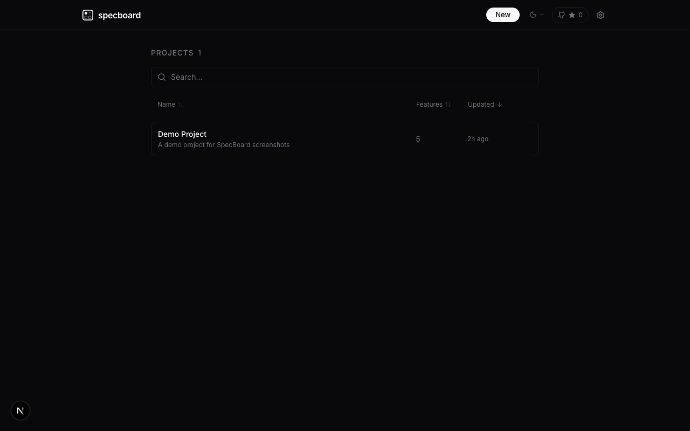
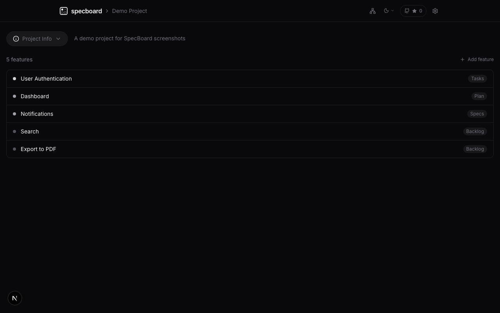
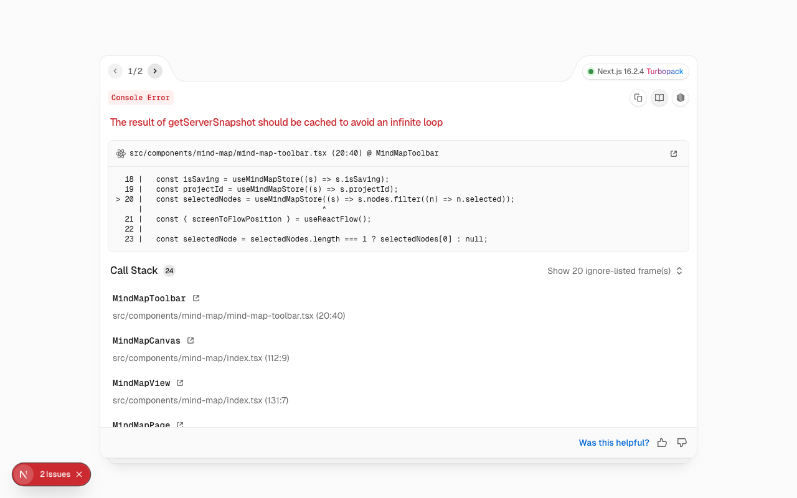
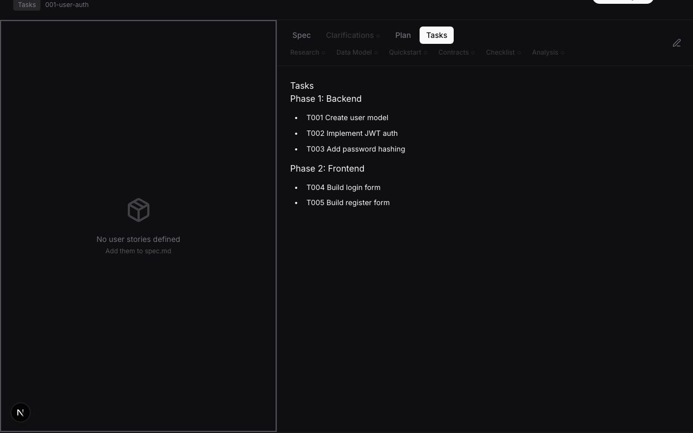

# SpecBoard

> Spec management tool with AI-powered pipeline, mind map brainstorming, and MCP server for AI coding agents.


SpecBoard turns ideas into structured specs through a 4-stage AI pipeline: **Backlog → Specs → Plan → Tasks**. It combines a visual mind map for brainstorming, a CodeMirror editor for spec writing, and an MCP server that lets AI coding agents (Claude Code, Cursor, Copilot) read and write specs directly.

## Screenshots

### Project Home

Browse and manage your projects.



### Feature List

Track features across pipeline stages with progress indicators.



### Mind Map

Brainstorm ideas on a freeform canvas. Connect nodes, then convert them to features.



### Feature Detail

Two-panel layout: user stories + tasks on the left, document viewer/editor on the right. Edit specs inline with CodeMirror. View impact analysis.



## Features

- **4-Stage AI Pipeline** — Backlog → Specs → Plan → Tasks with automatic generation
- **Mind Map Canvas** — Freeform brainstorming with React Flow. Create nodes, connect ideas, convert to features
- **CodeMirror Editor** — Inline markdown editing with syntax highlighting and auto-save
- **Impact Analysis** — Visual dependency graph showing pipeline completeness and constitution drift
- **MCP Server** — Expose specs to AI coding agents via Model Context Protocol
- **CLI** — Manage specs from the terminal (`specboard list`, `specboard context`)
- **Constitution System** — Project-level principles with version history
- **Database-First** — All content stored in PostgreSQL, not scattered markdown files

## Quick Start

```bash
# Install
pnpm install

# Configure
cp .env.example .env
# Set DATABASE_URL and POSTGRES_URL_NON_POOLING

# Database
pnpm db:push

# Run
pnpm dev
```

## CLI & MCP

```bash
# CLI
pnpm cli list                              # List projects
pnpm cli get <project> <feature> spec      # Get spec content
pnpm cli context <project> <feature>       # Structured context for AI agents
pnpm cli create <project> <name> <desc>    # Create feature

# MCP Server (for AI coding agents)
pnpm mcp
```

### MCP Tools

| Tool | Description |
|------|-------------|
| `list_projects` | List all projects |
| `get_project` | Get project with features |
| `get_feature` | Get feature with all content |
| `get_spec` / `get_plan` / `get_tasks` | Get specific content |
| `get_context` | Structured context for AI consumption |
| `create_feature` | Create feature in backlog |
| `update_feature_content` | Update spec/plan/tasks |
| `update_task_status` | Mark task complete |

## Tech Stack

- **Framework**: Next.js 16 (App Router)
- **Database**: PostgreSQL + Prisma ORM
- **State**: Zustand
- **UI**: Tailwind CSS v4, shadcn/ui, Lucide icons
- **Mind Map**: React Flow (@xyflow/react)
- **Editor**: CodeMirror
- **AI**: Configurable — OpenAI, Anthropic, or any OpenAI-compatible API
- **MCP**: @modelcontextprotocol/sdk
- **CLI**: Commander

## Development

```bash
pnpm dev              # Dev server (port 3000)
pnpm build            # Production build
pnpm lint             # Linter
pnpm tsc --noEmit     # Type check
pnpm test:run         # Tests
pnpm db:studio        # Prisma Studio
pnpm db:migrate       # Create migration
```

## License

MIT
