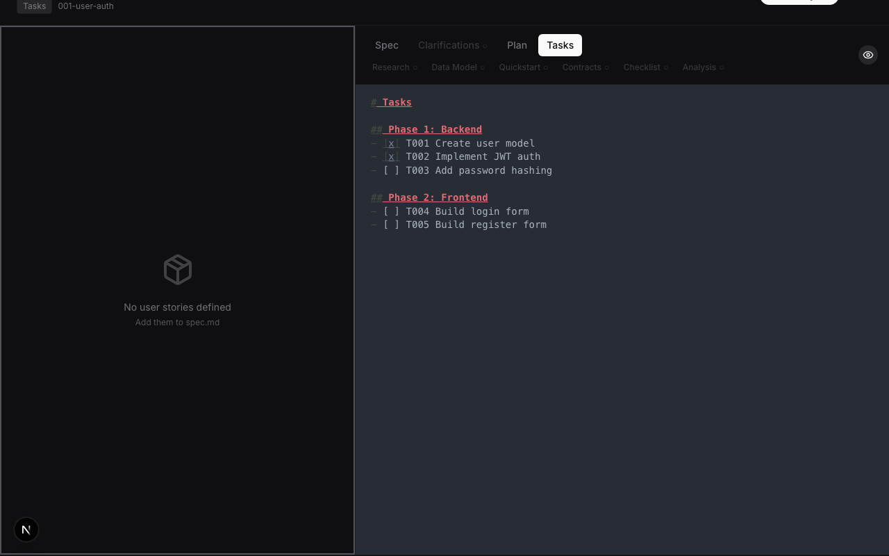
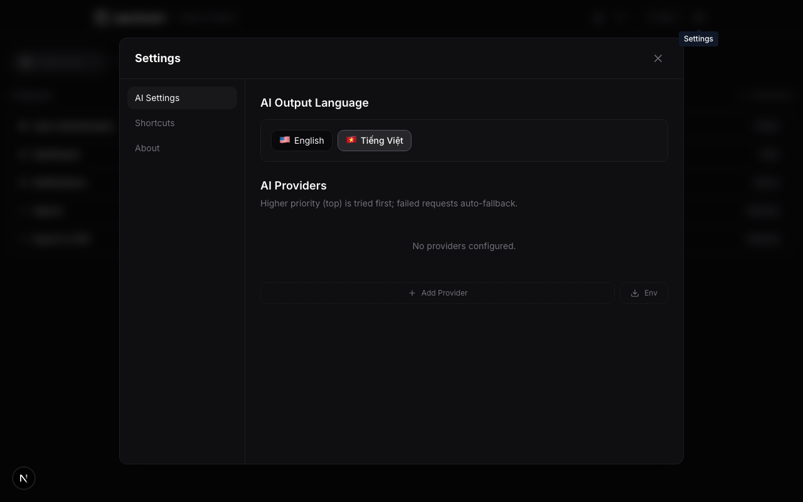

# SpecBoard

> Spec management tool with AI-powered pipeline, mind map brainstorming, and MCP server for AI coding agents.


SpecBoard turns ideas into structured specs through a 4-stage AI pipeline: **Backlog → Specs → Plan → Tasks**. It combines a visual mind map for brainstorming, a CodeMirror editor for spec writing, and an MCP server that lets AI coding agents (Claude Code, Cursor, Copilot) read and write specs directly.

## Screenshots

### Project Home

Browse and manage your projects. Search, sort by name/features/updated date, and create new projects.


### Feature List

Track features across pipeline stages with color-coded status dots, stage labels, and task completion percentages. Add new features directly from the project view.


### Feature Detail

Two-panel Jira-style layout: user stories and tasks on the left, document viewer on the right. Navigate between spec, plan, tasks, clarifications, and other documents using the dropdown selector.


### CodeMirror Editor

Edit specs inline with markdown syntax highlighting. Toggle between edit and preview modes with the pencil/eye button. Changes auto-save to the database with a 1.5s debounce.



### Mind Map

Brainstorm ideas on a freeform React Flow canvas. Double-click to add nodes, drag from handles to connect them. Right-click for context menu (convert to feature, delete). Color picker for node customization.


### Settings

Configure AI providers with priority-based load balancing. Add multiple providers (OpenAI, Anthropic, Gemini, Mistral), manage API keys, toggle providers on/off, and import from environment variables.



## Features

- **4-Stage AI Pipeline** — Backlog → Specs → Plan → Tasks with automatic generation
- **Mind Map Canvas** — Freeform brainstorming with React Flow. Create nodes, connect ideas, convert to features
- **CodeMirror Editor** — Inline markdown editing with syntax highlighting and auto-save
- **Impact Analysis** — Visual dependency graph showing pipeline completeness and constitution drift
- **MCP Server** — Expose specs to AI coding agents via Model Context Protocol
- **CLI** — Manage specs from the terminal (`specboard list`, `specboard context`)
- **Constitution System** — Project-level principles with version history
- **Database-First** — All content stored in PostgreSQL, not scattered markdown files

## Quick Start

```bash
# Install
pnpm install

# Configure
cp .env.example .env
# Set DATABASE_URL and POSTGRES_URL_NON_POOLING

# Database
pnpm db:push

# Run
pnpm dev
```

## CLI & MCP

```bash
# CLI (8 commands)
pnpm cli list                              # List projects (with last updated)
pnpm cli get <project> <feature> spec      # Get spec content
pnpm cli context <project> <feature>       # Stage-aware context for AI agents
pnpm cli create <project> <name> <desc>    # Create feature
pnpm cli constitution <project>            # Get project constitution
pnpm cli search <project> <query>          # Search features by text
pnpm cli stage <project> [stage]           # Show stage breakdown or list by stage
pnpm cli advance <project> <feature>       # Move feature to next stage

# MCP Server (17 tools, for AI coding agents)
pnpm mcp
```

### MCP Tools (17)

| Tool | Description |
|------|-------------|
| `list_projects` | List all projects with feature counts and last updated date |
| `get_project` | Get project overview with features and stage breakdown |
| `get_feature` | Get feature details (summary by default, full content optional) |
| `get_spec` / `get_plan` / `get_tasks` | Get specific content for a feature |
| `get_constitution` | Get project constitution with recent versions |
| `get_context` | Stage-aware context for AI agent consumption |
| `search_features` | Search features by text across names, descriptions, and content |
| `get_features_by_stage` | List features in a specific pipeline stage |
| `create_feature` | Create feature in backlog |
| `update_feature_content` | Update spec/plan/tasks (full replace or diff patch) |
| `update_task_status` | Mark task complete/incomplete |
| `advance_feature` | Move feature to next pipeline stage |
| `update_feature_stage` | Set feature to a specific stage |
| `propose_spec_change` | Preview a diff-based change without saving |
| `report_implementation` | Record what was built (appends to analysis) |

## Tech Stack

- **Framework**: Next.js 16 (App Router)
- **Database**: PostgreSQL + Prisma ORM
- **State**: Zustand
- **UI**: Tailwind CSS v4, shadcn/ui, Lucide icons
- **Mind Map**: React Flow (@xyflow/react)
- **Editor**: CodeMirror
- **AI**: Configurable — OpenAI, Anthropic, or any OpenAI-compatible API
- **MCP**: @modelcontextprotocol/sdk
- **CLI**: Commander

## Development

```bash
pnpm dev              # Dev server (port 3000)
pnpm build            # Production build
pnpm lint             # Linter
pnpm tsc --noEmit     # Type check
pnpm test:run         # Tests
pnpm db:studio        # Prisma Studio
pnpm db:migrate       # Create migration
```

## License

MIT
